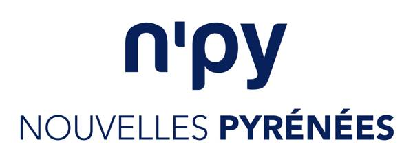
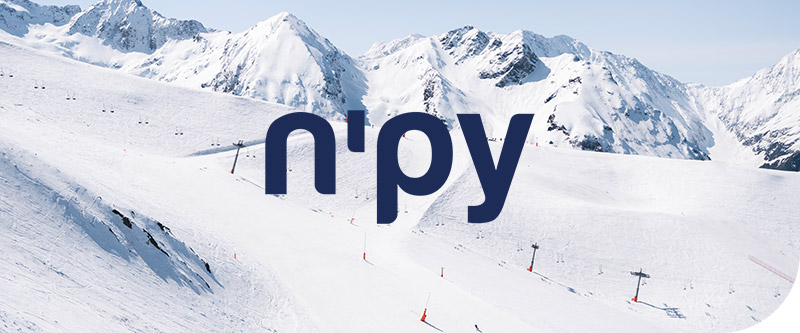
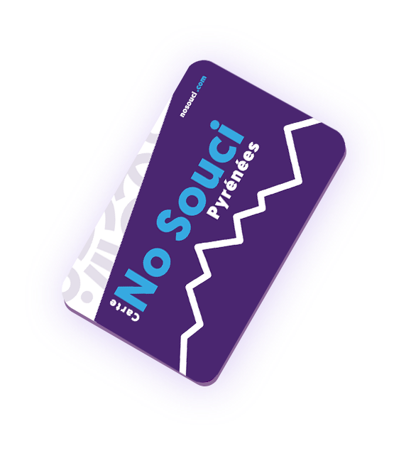

<!DOCTYPE html>
<html lang="fr">
<head>
    <meta charset="UTF-8">
    <meta name="viewport" content="width=device-width, initial-scale=1.0">
    <meta name="description" content="Carte ski étudiant Pyrénées : fini le passage en caisse, ski paiement à l’usage et réductions jusqu'à -30% dans 14 stations pour les étudiants.">
    <meta property="og:title" content="Carte ski étudiant Pyrénées | Carte No Souci Pyrénées">
    <meta property="og:description" content="BDE, campus et étudiants : accédez directement aux pistes sans rechargement. Skiez à prix réduit dans 14 stations des Pyrénées.">
    <meta property="og:type" content="website">
    <title>Partenariat BDE : Carte ski étudiant Pyrénées | Carte No Souci Pyrénées</title>
    
</head>
<body>

    <nav class="top-nav">
        

            
        

    </nav>

    <header>
        

            <h1>Offrez le ski facile et à prix réduit à vos étudiants</h1>
            
Proposez à votre campus le sésame ultime pour skier dans 14 stations des Pyrénées. Fini les attentes aux caisses, place au paiement à l'usage et aux réductions étudiantes massives.

        

        
    </header>

    <section class="benefits">
        

            

                <h2>4 raisons d'adopter la Carte No Souci pour votre BDE</h2>
            

            

                

                    <h3>✅ Zéro charge mentale</h3>
                    
Valorisez votre offre étudiante avec un service "clé en main". Vous n'avez aucune commande de forfaits cartonnés à gérer, aucune récolte de fonds. Tout est 100% digitalisé via un code promo école.

                

                

                    <h3>💸 Budget étudiant préservé</h3>
                    
Les réductions sont automatiques : <strong>jusqu'à -30%</strong> sur les journées skiées en semaine (hors vacances), et <strong>-15%</strong> le week-end. La 7ème journée de la saison est à <strong>-50%</strong> !

                

                

                    <h3>🎿 Fini le passage en caisse</h3>
                    
Le système est basé sur le télépéage : on skie d'abord, on est prélevé le mois suivant uniquement pour les journées réellement consommées. Accès direct aux remontées !

                

                

                    <h3>🛡️ Assurance secours incluse</h3>
                    
C'est l'argument qui rassure l'administration : l'assurance secours sur piste est <strong>intégrée par défaut</strong> à l'abonnement. En cas de pépin, les frais d'évacuation sont couverts.

                

            

        

    </section>

    <section class="lifestyle-section">
        

            
        

    </section>

    <section class="credibility">
        

            <h2>Le plus grand terrain de jeu des Pyrénées</h2>
            

                

                    
La <strong>Carte No Souci Pyrénées</strong> s'appuie sur le savoir-faire pionnier de N'PY. Elle ouvre les portes de <strong>14 domaines skiables majeurs</strong> à travers la chaîne (Ouest, Centre, Est et Ariège).

                    
                    
Vos étudiants pourront rider à :

                    <ul style="list-style-type: none; margin-left: 0; line-height: 1.8;">
                        <li>❄️ <strong>Réseau historique :</strong> Peyragudes, Piau-Engaly, Grand Tourmalet, Pic du Midi, Luz-Ardiden, Cauterets, Gourette, La Pierre Saint-Martin.</li>
                        <li>❄️ <strong>Partenaires :</strong> Ax 3 Domaines, Guzet, Les Monts d'Olmes, Formiguères, Porté-Puymorens et le Cambre d'Aze.</li>
                    </ul>
                

                

                    
                

            

        

    </section>

    <section class="faq">
        

            <h2>Questions Fréquentes (FAQ BDE)</h2>

            

                <h3>À qui s'adresse le programme Partenaire N'PY ?</h3>
                

                    
Il s'adresse aux Bureaux des Élèves (BDE), Bureaux des Sports (BDS), associations universitaires et administrations d'écoles qui souhaitent offrir un avantage exclusif à leurs étudiants pour la saison d'hiver.

                

            

            

                <h3>L'école ou le BDE doit-il payer quelque chose ?</h3>
                

                    
<strong>Non, c'est un partenariat 100% gratuit pour votre structure.</strong> Nous vous fournissons un code promotionnel unique. Les étudiants s'abonnent individuellement sur notre plateforme en utilisant ce code pour bénéficier d'un tarif préférentiel sur l'adhésion annuelle.

                

            

            

                <h3>Comment les étudiants reçoivent-ils leur carte ?</h3>
                

                    
Tout se passe en ligne. L'étudiant s'inscrit, renseigne son adresse postale, et reçoit sa carte personnelle équipée d'une puce RFID directement dans sa boîte aux lettres sous quelques jours.

                

            

        

    </section>

    <section class="cta">
        

            <h2>Prêt à booster la vie de votre campus ?</h2>
            
Mettez en place votre partenariat BDE gratuitement en moins de 48 heures. Proposez à vos étudiants le ski en toute liberté.

            <a href="mailto:contact@n-py.com" class="btn">Créer notre partenariat BDE (Gratuit)</a>
        

    </section>

    <footer>
        

            
© 2026 N'PY - Carte No Souci Pyrénées

            
Le réseau n°1 des stations de ski des Pyrénées françaises

        

    </footer>

    
</body>
</html>
